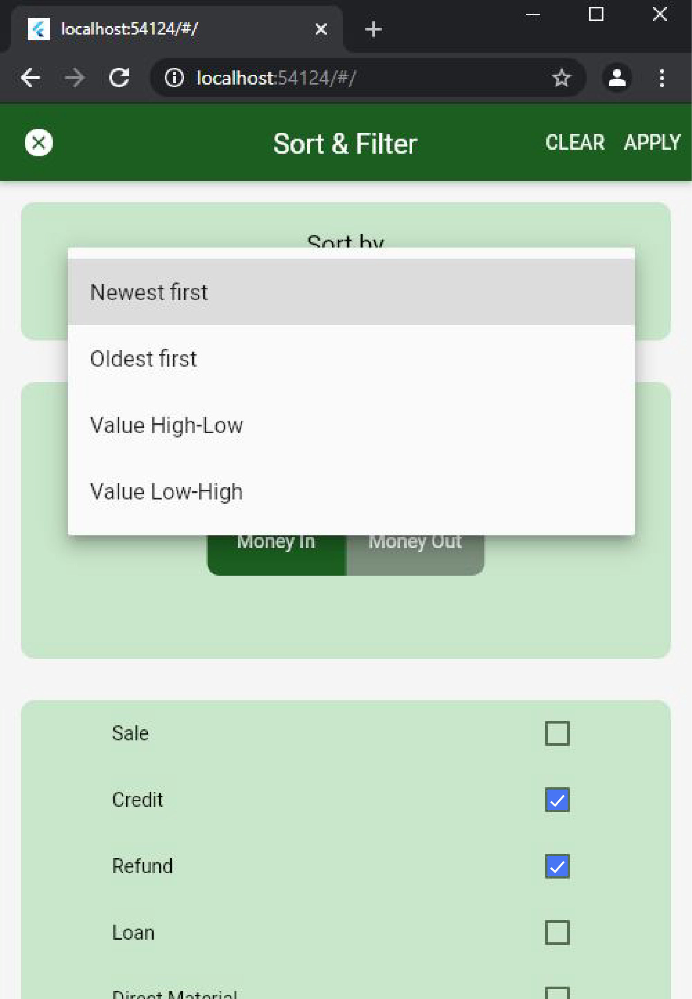

# Dropdown-Toggle-Checkbox-Widgets-Flutter
## Using Flutter

# Software Installation
### Visual Studio Code
To install the code editor Visual Studio Code [Click Here!](https://code.visualstudio.com/)

### Flutter SDK
To install Flutter SDK [Click Here!](https://flutter.dev/docs/get-started/install)

# Project Configuration Guidelines (Step by Step):

### Step 1. Clone the repo
There are two ways to download the project to the system. You can use any one of them.
#### •	Option 1
Open Github project repository that you want to download, at the right hand there will be a button “Code”. Click on that button. It will show the option to copy the repo’s URL. Copy that. After that open Git bash in the destination location where you want to download the project and run the following commands:
```
git clone Github repo URL
 
For example git clone https://github.com/ayeshatahirme/Dropdown-Toggle-Checkbox-Widgets-Flutter.git
```
#### •	Option 2
Open Github project repository that you want to download, at the right hand there will be a button “Code”. Click on that button. It will show the option to download zip. Click on the **“Download Zip”** option to download it on your system.

### Step 2. Open in Code Editor
To run the project, you need to open it in Visual Studio Code. Open the project folder, there will be another folder named **“Dropdown-Toggle-Checkbox-Widgets-Flutter”**. This folder contains the files that you will need to set up the project.
Connect your phone using data cable with laptop. Both laptop and device must have same internet connected. Turn on the **usb debugging** on device.

### Step 5. Run the project.
Now you are all set to run the project. To run the Visual Studio Code run **flutter run** command.

### Screenshots of app
<p>
 
 
 
 


</p>
